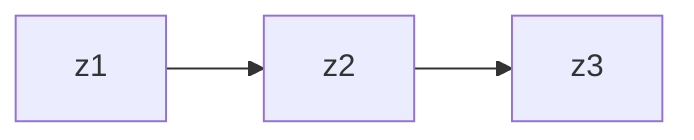
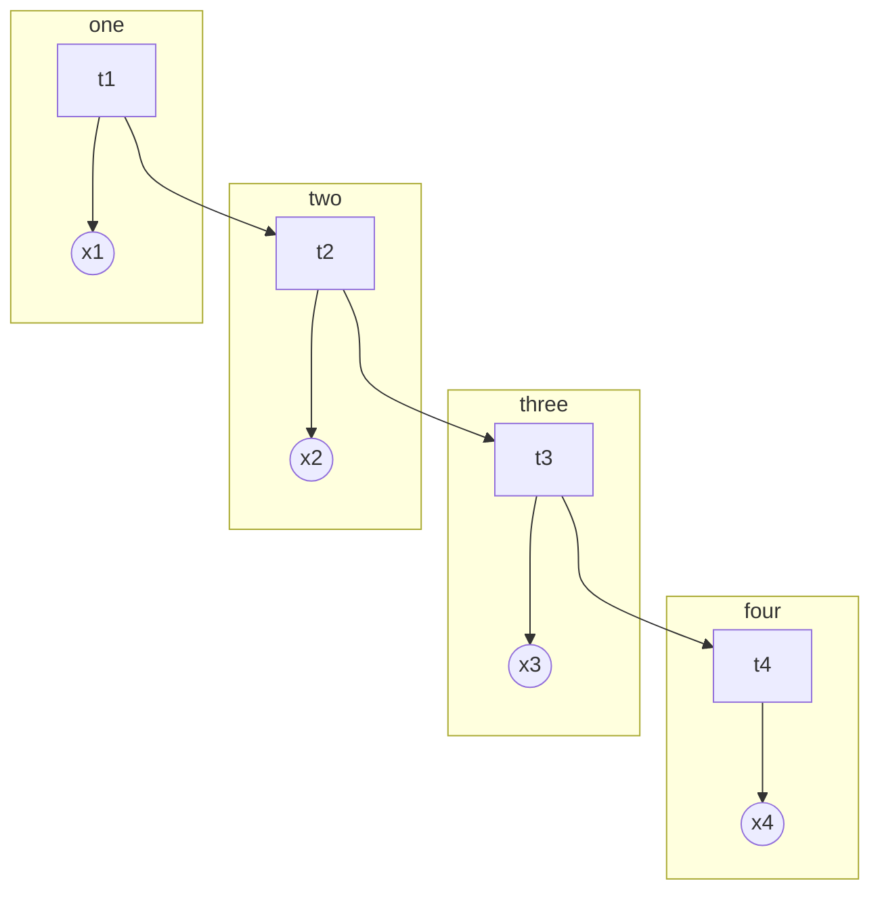

## 隐马尔可夫模型

隐马尔可夫模型是一种概率图模型。我们知道，机器学习模型可以从频率派和贝叶斯派两个方向考虑，在频率派的方法中的核心是优化问题，而在贝叶斯派的方法中，核心是积分问题，也发展出来了一系列的积分方法如变分推断，MCMC 等。概率图模型最基本的模型可以分为有向图（贝叶斯网络）和无向图（马尔可夫随机场）两个方面，例如 GMM，在这些基本的模型上，如果样本之间存在关联，可以认为样本中附带了时序信息，从而样本之间不独立全同分布的，这种模型就叫做动态模型，隐变量随着时间发生变化，于是观测变量也发生变化：

根据状态变量的特点，可以分为：

1.  HMM，状态变量（隐变量）是离散的
2.  Kalman 滤波，状态变量是连续的，线性的
3.  粒子滤波，状态变量是连续，非线性的

## HMM

HMM 用概率图表示为：

上图表示了四个时刻的隐变量变化。用参数 $\lambda=(\pi,A,B)$ 来表示，其中 $\pi$ 是开始的概率分布，$A$ 为状态转移矩阵，$B$ 为发射矩阵。

下面使用 $ o_t$ 来表示观测变量，$O$ 为观测序列，$V=\{v_1,v_2,\cdots,v_M\}$ 表示观测的值域，$i_t$ 表示状态变量，$I$ 为状态序列，$Q=\{q_1,q_2,\cdots,q_N\}$ 表示状态变量的值域。定义 $A=(a_{ij}=p(i_{t+1}=q_j|i_t=q_i))$ 表示状态转移矩阵，$B=(b_j(k)=p(o_t=v_k|i_t=q_j))$ 表示发射矩阵。

在 HMM 中，有两个基本假设：

1.  齐次 Markov 假设（未来只依赖于当前）：
    $$
    p(i_{t+1}|i_t,i_{t-1},\cdots,i_1,o_t,o_{t-1},\cdots,o_1)=p(i_{t+1}|i_t)
    $$
    
2.  观测独立假设：
    $$
    p(o_t|i_t,i_{t-1},\cdots,i_1,o_{t-1},\cdots,o_1)=p(o_t|i_t)
    $$
    

HMM 要解决三个问题：

1.  Evaluation：$p(O|\lambda)$，Forward-Backward 算法
2.  Learning：$\lambda=\mathop{argmax}\limits_{\lambda}p(O|\lambda)$，EM 算法（Baum-Welch）
3.  Decoding：$I=\mathop{argmax}\limits_{I}p(I|O,\lambda)$，Vierbi 算法
    1.  预测问题：$p(i_{t+1}|o_1,o_2,\cdots,o_t)$
    2.  滤波问题：$p(i_t|o_1,o_2,\cdots,o_t)$

### Evaluation

$$
p(O|\lambda)=\sum\limits_{I}p(I,O|\lambda)=\sum\limits_{I}p(O|I,\lambda)p(I|\lambda)
$$

$$
p(I|\lambda)=p(i_1,i_2,\cdots,i_t|\lambda)=p(i_t|i_1,i_2,\cdots,i_{t-1},\lambda)p(i_1,i_2,\cdots,i_{t-1}|\lambda)
$$

根据齐次 Markov 假设：
$$
p(i_t|i_1,i_2,\cdots,i_{t-1},\lambda)=p(i_t|i_{t-1})=a_{i_{t-1}i_t}
$$
所以：
$$
p(I|\lambda)=\pi_1\prod\limits_{t=2}^Ta_{i_{t-1},i_t}
$$
又由于：
$$
p(O|I,\lambda)=\prod\limits_{t=1}^Tb_{i_t}(o_t)
$$
于是：
$$
p(O|\lambda)=\sum\limits_{I}\pi_{i_1}\prod\limits_{t=2}^Ta_{i_{t-1},i_t}\prod\limits_{t=1}^Tb_{i_t}(o_t)
$$
我们看到，上面的式子中的求和符号是对所有的观测变量求和，于是复杂度为 $O(N^T)$。

下面，记 $\alpha_t(i)=p(o_1,o_2,\cdots,o_t,i_t=q_i|\lambda)$，所以，$\alpha_T(i)=p(O,i_T=q_i|\lambda)$。我们看到：
$$
p(O|\lambda)=\sum\limits_{i=1}^Np(O,i_T=q_i|\lambda)=\sum\limits_{i=1}^N\alpha_T(i)
$$
对 $\alpha_{t+1}(j)$：
$$
\begin{align}\alpha_{t+1}(j)&=p(o_1,o_2,\cdots,o_{t+1},i_{t+1}=q_j|\lambda)\nonumber\\
&=\sum\limits_{i=1}^Np(o_1,o_2,\cdots,o_{t+1},i_{t+1}=q_j,i_t=q_i|\lambda)\nonumber\\
&=\sum\limits_{i=1}^Np(o_{t+1}|o_1,o_2,\cdots,i_{t+1}=q_j,i_t=q_i|\lambda)p(o_1,\cdots,o_t,i_t=q_i,i_{t+1}=q_j|\lambda)
\end{align}
$$
利用观测独立假设：
$$
\begin{align}\alpha_{t+1}(j)&=\sum\limits_{i=1}^Np(o_{t+1}|i_{t+1}=q_j)p(o_1,\cdots,o_t,i_t=q_i,i_{t+1}=q_j|\lambda)\nonumber\\
&=\sum\limits_{i=1}^Np(o_{t+1}|i_{t+1}=q_j)p(i_{t+1}=q_j|o_1,\cdots,o_t,i_t=q_i,\lambda)p(o_1,\cdots,o_t,i_t=q_i|\lambda)\nonumber\\
&=\sum\limits_{i=1}^Nb_{j}(o_t)a_{ij}\alpha_t(i)
\end{align}
$$
上面利用了齐次 Markov 假设得到了一个递推公式，这个算法叫做前向算法。

还有一种算法叫做后向算法，定义 $\beta_t(i)=p(o_{t+1},o_{t+1},\cdots，o_T|i_t=i,\lambda)$：
$$
\begin{align}p(O|\lambda)&=p(o_1,\cdots,o_T|\lambda)\nonumber\\
&=\sum\limits_{i=1}^Np(o_1,o_2,\cdots,o_T,i_1=q_i|\lambda)\nonumber\\
&=\sum\limits_{i=1}^Np(o_1,o_2,\cdots,o_T|i_1=q_i,\lambda)\pi_i\nonumber\\
&=\sum\limits_{i=1}^Np(o_1|o_2,\cdots,o_T,i_1=q_i,\lambda)p(o_2,\cdots,o_T|i_1=q_i,\lambda)\pi_i\nonumber\\
&=\sum\limits_{i=1}^Nb_i(o_1)\pi_i\beta_1(i)
\end{align}
$$
对于这个 $\beta_1(i)$：
$$
\begin{align}\beta_t(i)&=p(o_{t+1},\cdots,o_T|i_t=q_i)\nonumber\\
&=\sum\limits_{j=1}^Np(o_{t+1},o_{t+2},\cdots,o_T,i_{t+1}=q_j|i_t=q_i)\nonumber\\
&=\sum\limits_{j=1}^Np(o_{t+1},\cdots,o_T|i_{t+1}=q_j,i_t=q_i)p(i_{t+1}=q_j|i_t=q_i)\nonumber\\
&=\sum\limits_{j=1}^Np(o_{t+1},\cdots,o_T|i_{t+1}=q_j)a_{ij}\nonumber\\
&=\sum\limits_{j=1}^Np(o_{t+1}|o_{t+2},\cdots,o_T,i_{t+1}=q_j)p(o_{t+2},\cdots,o_T|i_{t+1}=q_j)a_{ij}\nonumber\\
&=\sum\limits_{j=1}^Nb_j(o_{t+1})a_{ij}\beta_{t+1}(j)
\end{align}
$$
于是后向地得到了第一项。

### Learning

为了学习得到参数的最优值，在 MLE 中：
$$
\lambda_{MLE}=\mathop{argmax}_\lambda p(O|\lambda)
$$
我们采用 EM 算法（在这里也叫 Baum Welch 算法），用上标表示迭代：
$$
\theta^{t+1}=\mathop{argmax}_{\theta}\int_z\log p(X,Z|\theta)p(Z|X,\theta^t)dz
$$
其中，$X$ 是观测变量，$Z$ 是隐变量序列。于是：
$$
\lambda^{t+1}=\mathop{argmax}_\lambda\sum\limits_I\log p(O,I|\lambda)p(I|O,\lambda^t)\\
=\mathop{argmax}_\lambda\sum\limits_I\log p(O,I|\lambda)p(O,I|\lambda^t)
$$
 这里利用了 $p(O|\lambda^t)$ 和$\lambda$ 无关。将 Evaluation 中的式子代入：
$$
\sum\limits_I\log p(O,I|\lambda)p(O,I|\lambda^t)=\sum\limits_I[\log \pi_{i_1}+\sum\limits_{t=2}^T\log a_{i_{t-1},i_t}+\sum\limits_{t=1}^T\log b_{i_t}(o_t)]p(O,I|\lambda^t)
$$
对 $\pi^{t+1}$：
$$
\begin{align}\pi^{t+1}&=\mathop{argmax}_\pi\sum\limits_I[\log \pi_{i_1}p(O,I|\lambda^t)]\nonumber\\
&=\mathop{argmax}_\pi\sum\limits_I[\log \pi_{i_1}\cdot p(O,i_1,i_2,\cdots,i_T|\lambda^t)]
\end{align}
$$
上面的式子中，对 $i_2,i_2,\cdots,i_T$ 求和可以将这些参数消掉：
$$
\pi^{t+1}=\mathop{argmax}_\pi\sum\limits_{i_1}[\log \pi_{i_1}\cdot p(O,i_1|\lambda^t)]
$$
上面的式子还有对 $\pi$ 的约束 $\sum\limits_i\pi_i=1$。定义 Lagrange 函数：
$$
L(\pi,\eta)=\sum\limits_{i=1}^N\log \pi_i\cdot p(O,i_1=q_i|\lambda^t)+\eta(\sum\limits_{i=1}^N\pi_i-1)
$$
于是：
$$
\frac{\partial L}{\partial\pi_i}=\frac{1}{\pi_i}p(O,i_1=q_i|\lambda^t)+\eta=0
$$
对上式求和：
$$
\sum\limits_{i=1}^Np(O,i_1=q_i|\lambda^t)+\pi_i\eta=0\Rightarrow\eta=-p(O|\lambda^t)
$$
所以：
$$
\pi_i^{t+1}=\frac{p(O,i_1=q_i|\lambda^t)}{p(O|\lambda^t)}
$$

### Decoding

Decoding 问题表述为：
$$
I=\mathop{argmax}\limits_{I}p(I|O,\lambda)
$$
我们需要找到一个序列，其概率最大，这个序列就是在参数空间中的一个路径，可以采用动态规划的思想。

定义：
$$
\delta_{t}(j)=\max\limits_{i_1,\cdots,i_{t-1}}p(o_1,\cdots,o_t,i_1,\cdots,i_{t-1},i_t=q_i)
$$
于是：
$$
\delta_{t+1}(j)=\max\limits_{1\le i\le N}\delta_t(i)a_{ij}b_j(o_{t+1})
$$
这个式子就是从上一步到下一步的概率再求最大值。记这个路径为：
$$
\psi_{t+1}(j)=\mathop{argmax}\limits_{1\le i\le N}\delta_t(i)a_{ij}
$$

## 小结

HMM 是一种动态模型，是由混合树形模型和时序结合起来的一种模型（类似 GMM + Time）。对于类似 HMM 的这种状态空间模型，普遍的除了学习任务（采用 EM ）外，还有推断任务，推断任务包括：

1.  译码 Decoding：$p(z_1,z_2,\cdots,z_t|x_1,x_2,\cdots,x_t)$

2.  似然概率：$p(X|\theta)$

3.  滤波：$ p(z_t|x_1,\cdots,x_t)$，Online
    $$
    p(z_t|x_{1:t})=\frac{p(x_{1:t},z_t)}{p(x_{1:t})}=C\alpha_t(z_t)
    $$

4.  平滑：$p(z_t|x_1,\cdots,x_T)$，Offline
    $$
    p(z_t|x_{1:T})=\frac{p(x_{1:T},z_t)}{p(x_{1:T})}=\frac{\alpha_t(z_t)p(x_{t+1:T}|x_{1:t},z_t)}{p(x_{1:T})}
    $$
    根据概率图的条件独立性，有：
    $$
    p(z_t|x_{1:T})=\frac{\alpha_t(z_t)p(x_{t+1:T}|z_t)}{p(x_{1:T})}=C\alpha_t(z_t)\beta_t(z_t)
    $$
    这个算法叫做前向后向算法。

5.  预测：$p(z_{t+1},z_{t+2}|x_1,\cdots,x_t),p(x_{t+1},x_{t+2}|x_1,\cdots,x_t)$
    $$
    p(z_{t+1}|x_{1:t})=\sum_{z_t}p(z_{t+1},z_t|x_{1:t})=\sum\limits_{z_t}p(z_{t+1}|z_t)p(z_t|x_{1:t})
    $$

    $$
    p(x_{t+1}|x_{1:t})=\sum\limits_{z_{t+1}}p(x_{t+1},z_{t+1}|x_{1:t})=\sum\limits_{z_{t+1}}p(x_{t+1}|z_{t+1})p(z_{t+1}|x_{1:t})
    $$

