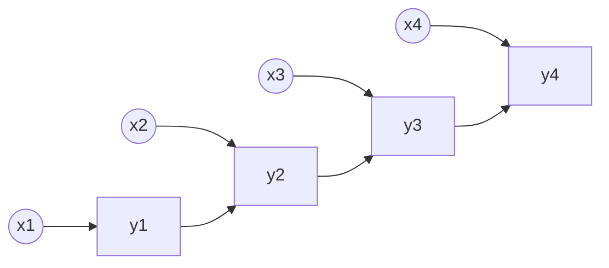
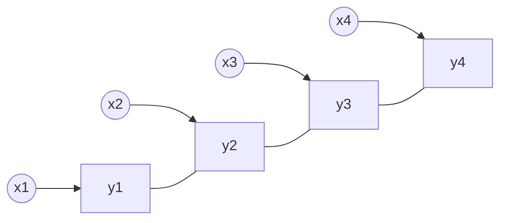

# 条件随机场

我们知道，分类问题可以分为硬分类和软分类两种，其中硬分类有 SVM，PLA，LDA 等。软分类问题大体上可以分为概率生成和概率判别模型，其中较为有名的概率判别模型有 Logistic 回归，生成模型有朴素贝叶斯模型。Logistic 回归模型的损失函数为交叉熵，这类模型也叫对数线性模型，一般地，又叫做最大熵模型，这类模型和指数族分布的概率假设是一致的。对朴素贝叶斯假设，如果将其中的单元素的条件独立性做推广到一系列的隐变量，那么，由此得到的模型又被称为动态模型，比较有代表性的如 HMM，从概率意义上，HMM也可以看成是 GMM 在时序上面的推广。

我们看到，一般地，如果将最大熵模型和 HMM相结合，那么这种模型叫做最大熵 Markov 模型（MEMM）：

这个图就是将 HMM 的图中观测变量和隐变量的边方向反向，应用在分类中，隐变量就是输出的分类，这样 HMM 中的两个假设就不成立了，特别是观测之间不是完全独立的了。

HMM 是一种生成式模型，其建模对象为 $p(X,Y|\lambda)$，根据 HMM 的概率图，$p(X,Y|\lambda)=\prod\limits_{t=1}^Tp(x_t,y_t|\lambda,y_{t-1})$。我们看到，观测独立性假设是一个很强的假设，如果我们有一个文本样本，那么观测独立性假设就假定了所有的单词之间没有关联。

在 MEMM 中，建模对象是 $p(Y|X,\lambda)$，我们看概率图，给定 $y_t$，$x_t,x_{t-1}$ 是不独立的，这样，观测独立假设就不成立了。根据概率图，$p(Y|X,\lambda)=\prod\limits_{t=1}^Tp(y_t|y_{t-1},X,\lambda)$。

MEMM 的缺陷是其必须满足局域的概率归一化（Label Bias Problem），我们看到，在上面的概率图中，$p(y_t|y_{t-1},x_t)$， 这个概率，如果 $p(y_t|y_{t-1})$ 非常接近1，那么事实上，观测变量是什么就不会影响这个概率了。

对于这个问题，我们将 $y$ 之间的箭头转为直线转为无向图（线性链条件随机场），这样就只要满足全局归一化了（破坏齐次 Markov 假设）。

## CRF 的 PDF

线性链的 CRF 的 PDF 为 $p(Y|X)=\frac{1}{Z}\exp\sum\limits_{t=1}^T(F_t(y_{t-1},y_t,x_{1:T}))$，两两形成了最大团，其中 $y_0$ 是随意外加的一个元素。作为第一个简化，我们假设每个团的势函数相同 $F_t=F$。

对于这个 $F$，我们进一步，可以将其写为 $ F(y_{t-1},y_t,X)=\Delta_{y_{t-1},X}+\Delta_{y_{t},X}+\Delta_{y_t,y_{t-1},X}$这三个部分，分别表示状态函数已经转移函数，由于整体的求和，可以简化为 $ F(y_{t-1},y_t,X)=\Delta_{y_{t},X}+\Delta_{y_t,y_{t-1},X}$。

我们可以设计一个表达式将其参数化：
$$
\begin{align}
\Delta_{y_t,y_{t-1},X}&=\sum\limits_{k=1}^K\lambda_kf_k(y_{t-1},y_t,X)\\
\Delta_{y_{t},X}&=\sum\limits_{l=1}^L\eta_lg_l(y_t,X)
\end{align}
$$
其中 $g,f $ 叫做特征函数，对于 $y$ 有 $S$ 种元素，那么 $K\le S^2,L\le S$。

代入概率密度函数中：
$$
p(Y|X)=\frac{1}{Z}\exp\sum\limits_{t=1}^T[\sum\limits_{k=1}^K\lambda_kf_k(y_{t-1},y_t,X)+\sum\limits_{l=1}^L\eta_lg_l(y_t,X)]
$$
对于单个样本，将其写成向量的形式。定义 $y=(y_1,y_2,\cdots,y_T)^T,x=(x_1,x_2,\cdots,x_T)^T,\lambda=(\lambda_1,\lambda_2,\cdots,\lambda_K)^T,\eta=(\eta_1,\eta_2,\cdots,\eta_L)^T$。并且有 $f=(f_1,f_2,\cdots,f_K)^T,g=(g_1,g_2,\cdots,g_L)^T$。于是：
$$
p(Y=y|X=x)=\frac{1}{Z}\exp\sum\limits_{t=1}^T[\lambda^Tf(y_{t-1},y_t,x)+\eta^Tg(y_t,x)]
$$
不妨记：$\theta=(\lambda,\eta)^T,H=(\sum\limits_{t=1}^Tf,\sum\limits_{t=1}^Tg)^T$：
$$
p(Y=y|X=x)=\frac{1}{Z(x,\theta)}\exp[\theta^TH(y_t,y_{t-1},x)]
$$
上面这个式子是一个指数族分布，于是 $Z$ 是配分函数。

CRF 需要解决下面几个问题：

1.  Learning：参数估计问题，对 $N$ 个 $T$ 维样本，$\hat{\theta}=\mathop{argmax}\limits_{\theta}\prod\limits_{i=1}^Np(y^i|x^i)$，这里用上标表示样本的编号。

2.  Inference：

    1.  边缘概率：
        $$
        p(y_t|x)
        $$
        
2.  条件概率：一般在生成模型中较为关注，CRF 中不关注
    
3.  MAP 推断：
        $$
        \hat{y}=\mathop{argmax}p(y|x)
        $$
        

## 边缘概率

边缘概率这个问题描述为，根据学习任务得到的参数，给定了 $p(Y=y|X=x)$，求解 $p(y_t=i|x)$。根据无向图可以给出：
$$
p(y_t=i|x)=\sum\limits_{y_{1:t-1},y_{t+1:T}}p(y|x)=\sum\limits_{y_{1:t-1}}\sum\limits_{y_{t+1:T}}\frac{1}{Z}\prod\limits_{t'=1}^T\phi_{t'}(y_{t'-1},y_{t'},x)
$$
我们看到上面的式子，直接计算的复杂度很高，这是由于求和的复杂度在 $O(S^T)$，求积的复杂度在 $O(T)$，所以整体复杂度为 $O(TS^T)$。我们需要调整求和符号的顺序，从而降低复杂度。

首先，将两个求和分为：
$$
\begin{align}&p(y_t=i|x)=\frac{1}{Z}\Delta_l\Delta_r\\
&\Delta_l=\sum\limits_{y_{1:t-1}}\phi_{1}(y_0,y_1,x)\phi_2(y_1,y_2,x)\cdots\phi_{t-1}(y_{t-2},y_{t-1},x)\phi_t(y_{t-1},y_t=i,x)\\
&\Delta_r=\sum\limits_{y_{t+1:T}}\phi_{t+1}(y_t=i,y_{t+1},x)\phi_{t+2}(y_{t+1},y_{t+2},x)\cdots\phi_T(y_{T-1},y_T,x)
\end{align}
$$
对于 $\Delta_l$，从左向右，一步一步将 $y_t$ 消掉：
$$
\Delta_l=\sum\limits_{y_{t-1}}\phi_t(y_{t-1},y_t=i,x)\sum\limits_{y_{t-2}}\phi_{t-1}(y_{t-2},y_{t-1},x)\cdots\sum\limits_{y_0}\phi_1(y_0,y_1,x)
$$
引入：
$$
\alpha_t(i)=\Delta_l
$$
于是：
$$
\alpha_{t}(i)=\sum\limits_{j\in S}\phi_t(y_{t-1}=j,y_t=i,x)\alpha_{t-1}(j)
$$
这样我们得到了一个递推式。

类似地，$\Delta_r=\beta_t(i)=\sum\limits_{j\in S}\phi_{t+1}(y_t=i,y_{t+1}=j,x)\beta_{t+1}(j)$。这个方法和 HMM 中的前向后向算法类似，就是概率图模型中精确推断的变量消除算法（信念传播）。

## 参数估计

在进行各种类型的推断之前，还需要对参数进行学习：
$$
\begin{align}\hat{\theta}&=\mathop{argmax}_{\theta}\prod\limits_{i=1}^Np(y^i|x^i)\\
&=\mathop{argmax}_\theta\sum\limits_{i=1}^N\log p(y^i|x^i)\\
&=\mathop{argmax}_\theta\sum\limits_{i=1}^N[-\log Z(x^i,\lambda,\eta)+\sum\limits_{t=1}^T[\lambda^Tf(y_{t-1},y_t,x)+\eta^Tg(y_t,x)]]
\end{align}
$$
上面的式子中，第一项是对数配分函数，根据指数族分布的结论：
$$
\nabla_\lambda(\log Z(x^i,\lambda,\eta))=\mathbb{E}_{p(y^i|x^i)}[\sum\limits_{t=1}^Tf(y_{t-1},y_t,x^i)]
$$
其中，和 $\eta$ 相关的项相当于一个常数。求解这个期望值：
$$
\mathbb{E}_{p(y^i|x^i)}[\sum\limits_{t=1}^Tf(y_{t-1},y_t,x^i)]=\sum\limits_{y}p(y|x^i)\sum\limits_{t=1}^Tf(y_{t-1},y_t,x^i)
$$
第一个求和号的复杂度为 $O(S^T)$，重新排列求和符号：
$$
\begin{align}\mathbb{E}_{p(y^i|x^i)}[\sum\limits_{t=1}^Tf(y_{t-1},y_t,x^i)]&=\sum\limits_{t=1}^T\sum\limits_{y_{1:t-2}}\sum\limits_{y_{t-1}}\sum\limits_{y_t}\sum\limits_{y_{t+1:T}}p(y|x^i)f(y_{t-1},y_t,x^i)\nonumber\\
&=\sum\limits_{t=1}^T\sum\limits_{y_{t-1}}\sum\limits_{y_t}p(y_{t-1},y_t|x^i)f(y_{t-1},y_t,x^i)
\end{align}
$$
和上面的边缘概率类似，也可以通过前向后向算法得到上面式子中的边缘概率。

于是：
$$
\nabla_\lambda L=\sum\limits_{i=1}^N\sum\limits_{t=1}^T[f(y_{t-1},y_t,x^i)-\sum\limits_{y_{t-1}}\sum\limits_{y_t}p(y_{t-1},y_t|x^i)f(y_{t-1},y_t,x^i)]
$$
利用梯度上升算法可以求解。对于 $\eta$ 也是类似的过程。

## 译码

译码问题和 HMM 中的 Viterbi 算法类似，同样采样动态规划的思想一层一层求解最大值。