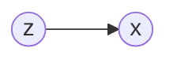

# 高斯混合模型

为了解决高斯模型的单峰性的问题，我们引入多个高斯模型的加权平均来拟合多峰数据：
$$
p(x)=\sum\limits_{k=1}^K\alpha_k\mathcal{N}(\mu_k,\Sigma_k)
$$
引入隐变量 $z$，这个变量表示对应的样本 $x$ 属于哪一个高斯分布，这个变量是一个离散的随机变量：
$$
p(z=i)=p_i,\sum\limits_{i=1}^kp(z=i)=1
$$
作为一个生成式模型，高斯混合模型通过隐变量 $z$ 的分布来生成样本。用概率图来表示：

其中，节点 $z$ 就是上面的概率，$x$ 就是生成的高斯分布。于是对 $p(x)$：
$$
p(x)=\sum\limits_zp(x,z)=\sum\limits_{k=1}^Kp(x,z=k)=\sum\limits_{k=1}^Kp(z=k)p(x|z=k)
$$
因此：
$$
p(x)=\sum\limits_{k=1}^Kp_k\mathcal{N}(x|\mu_k,\Sigma_k)
$$

## 极大似然估计

样本为 $X=(x_1,x_2,\cdots,x_N)$，$ (X,Z)$ 为完全参数，参数为 $\theta=\{p_1,p_2,\cdots,p_K,\mu_1,\mu_2,\cdots,\mu_K\Sigma_1,\Sigma_2,\cdots,\Sigma_K\}$。我们通过极大似然估计得到 $\theta$ 的值：
$$
\begin{align}\theta_{MLE}&=\mathop{argmax}\limits_{\theta}\log p(X)=\mathop{argmax}_{\theta}\sum\limits_{i=1}^N\log p(x_i)\nonumber\\
&=\mathop{argmax}_\theta\sum\limits_{i=1}^N\log \sum\limits_{k=1}^Kp_k\mathcal{N}(x_i|\mu_k,\Sigma_k)
\end{align}
$$
这个表达式直接通过求导，由于连加号的存在，无法得到解析解。因此需要使用 EM 算法。

## EM 求解 GMM

EM 算法的基本表达式为：$\theta^{t+1}=\mathop{argmax}\limits_{\theta}\mathbb{E}_{z|x,\theta_t}[p(x,z|\theta)]$。套用 GMM 的表达式，对数据集来说：
$$
\begin{align}Q(\theta,\theta^t)&=\sum\limits_z[\log\prod\limits_{i=1}^Np(x_i,z_i|\theta)]\prod \limits_{i=1}^Np(z_i|x_i,\theta^t)\nonumber\\
&=\sum\limits_z[\sum\limits_{i=1}^N\log p(x_i,z_i|\theta)]\prod \limits_{i=1}^Np(z_i|x_i,\theta^t)
\end{align}
$$
对于中间的那个求和号，展开，第一项为：
$$
\begin{align}
\sum\limits_z\log p(x_1,z_1|\theta)\prod\limits_{i=1}^Np(z_i|x_i,\theta^t)&=\sum\limits_z\log p(x_1,z_1|\theta)p(z_1|x_1,\theta^t)\prod\limits_{i=2}^Np(z_i|x_i,\theta^t)\nonumber\\
&=\sum\limits_{z_1}\log p(x_1,z_1|\theta)
p(z_1|x_1,\theta^t)\sum\limits_{z_2,\cdots,z_K}\prod\limits_{i=2}^Np(z_i|x_i,\theta^t)\nonumber\\
&=\sum\limits_{z_1}\log p(x_1,z_1|\theta)p(z_1|x_1,\theta^t)\end{align}
$$
类似地，$Q$ 可以写为：
$$
Q(\theta,\theta^t)=\sum\limits_{i=1}^N\sum\limits_{z_i}\log p(x_i,z_i|\theta)p(z_i|x_i,\theta^t)
$$
对于 $p(x,z|\theta)$：
$$
p(x,z|\theta)=p(z|\theta)p(x|z,\theta)=p_z\mathcal{N}(x|\mu_z,\Sigma_z)
$$
对 $p(z|x,\theta^t)$：
$$
p(z|x,\theta^t)=\frac{p(x,z|\theta^t)}{p(x|\theta^t)}=\frac{p_z^t\mathcal{N}(x|\mu_z^t,\Sigma_z^t)}{\sum\limits_kp_k^t\mathcal{N}(x|\mu_k^t,\Sigma_k^t)}
$$
代入 $Q$：
$$
Q=\sum\limits_{i=1}^N\sum\limits_{z_i}\log p_{z_i}\mathcal{N(x_i|\mu_{z_i},\Sigma_{z_i})}\frac{p_{z_i}^t\mathcal{N}(x_i|\mu_{z_i}^t,\Sigma_{z_i}^t)}{\sum\limits_kp_k^t\mathcal{N}(x_i|\mu_k^t,\Sigma_k^t)}
$$
下面需要对 $Q$ 值求最大值：
$$
Q=\sum\limits_{k=1}^K\sum\limits_{i=1}^N[\log p_k+\log \mathcal{N}(x_i|\mu_k,\Sigma_k)]p(z_i=k|x_i,\theta^t)
$$

1.  $p_k^{t+1}$：
    $$
    p_k^{t+1}=\mathop{argmax}_{p_k}\sum\limits_{k=1}^K\sum\limits_{i=1}^N[\log p_k+\log \mathcal{N}(x_i|\mu_k,\Sigma_k)]p(z_i=k|x_i,\theta^t)\ s.t.\ \sum\limits_{k=1}^Kp_k=1
    $$
    即：
    $$
    p_k^{t+1}=\mathop{argmax}_{p_k}\sum\limits_{k=1}^K\sum\limits_{i=1}^N\log p_kp(z_i=k|x_i,\theta^t)\ s.t.\ \sum\limits_{k=1}^Kp_k=1
    $$
    引入 Lagrange 乘子：$L(p_k,\lambda)=\sum\limits_{k=1}^K\sum\limits_{i=1}^N\log p_kp(z_i=k|x_i,\theta^t)-\lambda(1-\sum\limits_{k=1}^Kp_k)$。所以：
    $$
    \frac{\partial}{\partial p_k}L=\sum\limits_{i=1}^N\frac{1}{p_k}p(z_i=k|x_i,\theta^t)+\lambda=0\\
    \Rightarrow \sum\limits_k\sum\limits_{i=1}^N\frac{1}{p_k}p(z_i=k|x_i,\theta^t)+\lambda\sum\limits_kp_k=0\\
    \Rightarrow\lambda=-N
    $$
    
    于是有：
    $$
    p_k^{t+1}=\frac{1}{N}\sum\limits_{i=1}^Np(z_i=k|x_i,\theta^t)
    $$
    
2.  $\mu_k,\Sigma_k$，这两个参数是无约束的，直接求导即可。